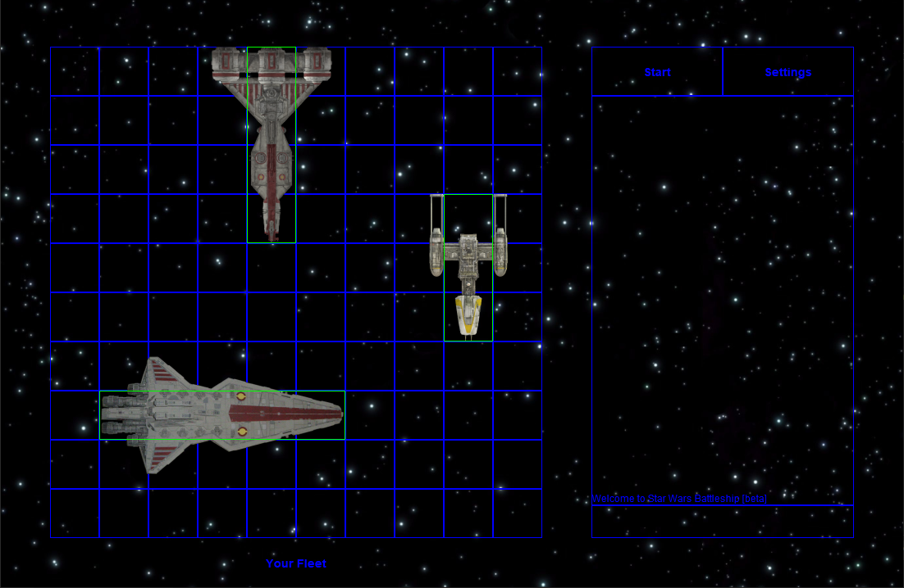

# Star Wars Battleship
## About
Star Wars Battleship is a work in progress attempt to create a Star Wars variant of the board game Battleship in Java Swing. I began this project as an AP Computer Science A assignment, but plan to continue to add on to it.
## Images

## Features
- [x] Single Player Battleship against a 'randomly choosing' bot opponent
- [x] Basic interface
- [ ] More ships & factions
- [ ] Local multiplayer on two devices with [Open Battleship](https://github.com/alexphanna/Open-Battleship)
- [ ] Main Menu
- [ ] Settings Menu
- [ ] Online multiplayer
